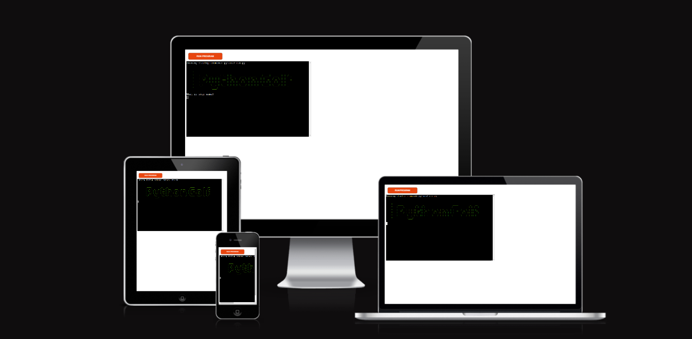

# Python Golf

Python Golf is a terminal based game I created for this project.
I wanted to do something a little different for this project.
Most of the examples I saw were games such as battleship or hangman, or they
were very similar to the love sandwiches walkthrough which I wanted to stay away from.
This game is like an adventure game but with a competitive twist, the users scores
are sent to a Google sheet to display the current leaderboard.
As a golfer myself I wanted to make something that interested me and I could
share with my friends and see who could get the best score.