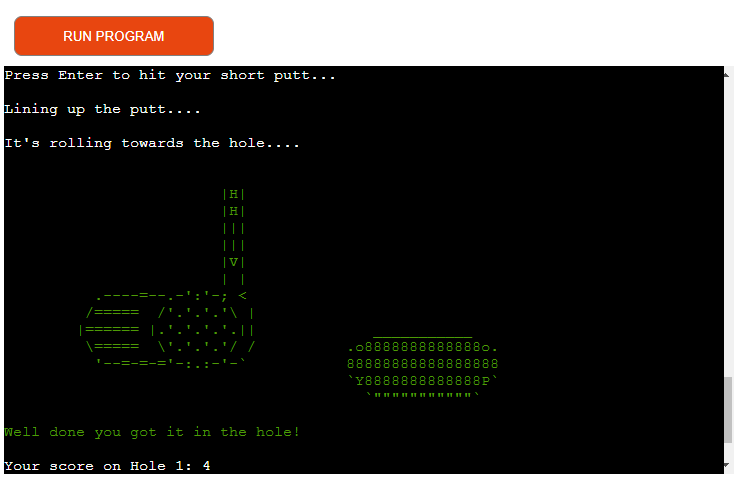

# Python Golf

Python Golf is a terminal based game I created for this project.
I wanted to do something a little different for this project.
Most of the examples I saw were games such as battleship or hangman, or they
were very similar to the love sandwiches walkthrough which I wanted to stay away from.
This game is like an adventure game but with a competitive twist, the users scores
are sent to a Google sheet to display the current leaderboard.
As a golfer myself I wanted to make something that interested me and I could
share with my friends and see who could get the best score.

The deployed project can be viewed [here.](https://python-golf-7c3c839b8f7b.herokuapp.com/)

The leaderboard workbook can be viewed [here.](https://docs.google.com/spreadsheets/d/1_881-aBxzA8TwstEB7xGB9ZpJzDYFXvt9tCD4hYbZWU/edit#gid=0)

## Table of Contents

1. [User Experience](#user-experience)
    1. [Project Goals](#project-goals)
    2. [User Stories](#user-stories)
    3. [Data collection](#data-collection)
2. [Features](#features)
    1. [Title screen](title-screen)
    2. [Rules](#rules)
    3. [Holes](#holes)
    4. [Club Selection](#club-selection)
    5. [Shot Outcome](#shot-outcome)
    6. [Putting](#putting)
    7. [Game Summary](#game-summary)
3. [Technologies Used](#technologies-used)
    1. [Languages](#languages)
    2. [Frameworks, Libraries and Programmes](#frameworks-libraries-and-programs)
4. [Testing](#testing)
    1. [Testing User Stories](#testing-user-stories)
    2. [Code Validation](#code-validation)
    3. [Feature Testing](#feature-testing)
    4. [Bugs](#bugs)
5. [Deployment](#deployment)
6. [Credits](#credits)
    

## User Experience

### Project Goals

- Make a fun interactive golf game.

- Store data in a google sheet.

- Add some user options to make the game more interesting.

- Have a leaderboard to make it more competitive.

- Use different color text to differentiate between good and bad shots / results.

- Use ascii art to break up text and make it more fun.

### User Stories

- As a player, I want the game to have simple rules to follow.

- As a player, I want the game to be interesting and entertaining.

- As a player, I want the outcome of each shot to be clear to me.

- As a player, I want the controls to be easy.

- As a player, I want to be able to access a leaderboard.

- As a player, I want to be shown a summary of my round.

- As a player I want to be given the option to play again.

[Back to top ⇧](#python-golf)

### Data Collection

- For this project I decided a Google sheet would be a good idea to add,
I learned a bit about this during the walkthrough and I wanted to test myself.

- In the workbook I have seperate leaderboards for 3-hole , 6-hole and 9-hole competitions.

- Once the user has finished the game the user name they entered along with their score is sent
to the correct sheet.

- I also used a script extension (see below) to order the leaderboards low - high as low score in golf wins.

## Features

### Title Screen

- The title screen just shows the name of the game, I used ascii art from [Patorjk.com](https://patorjk.com/) to create this.

- The title screen remains for 5 seconds before the game begins.

- After the 5 seconds the user will be asked to enter their name for the leaderboard.(see below)

### Rules

- The rules section starts with welcoming the player to the game.

- It then follows on with the rules of the game, I tried to make these
eay to understand as I know not everyone is familiar with the rules of golf.

- It outlines the club choice the user will have to make and explains
what each choice does and how it could affect their score.

- Also explains the rule for the penalty applied when you enter a hazard.
As this is slighty different to how a real game of golf would go.

[Back to top ⇧](#python-golf)

### Holes

- The highlighted input asks the user to play 3,6 or 9 holes.

- Depending on the users selection the program will send their
data to the appropiate worksheet.

- There is a title above each hole showing the user what hole they are currently on.

### Club Selection

- The user is then prompted to select a club for the tee shot.

- The driver has a greater chance at a great shot but also a greater chance at entering a hazard.

- The iron is the safer shot, less chance at a great shot or hazards but a
greater chance at hitting the fairway.

- Entering the club you want only chooses the club, the user still has to press enter to hit the shot.

### Shot Outcome

- After each shot there is a swing message that comes up.

- The swing message is different depending on the type of shot.

- I have also included a ascii art drawing to simulate a golfer swinging a club.

- The outcome message is included below the ascii art, I have added color
to the message to help the user determine the outcome. It's as simple as green
is good and red is bad.

- Above the outcome was bad , I've added a good outcome below to demonstrate.

[Back to top ⇧](#python-golf)

### Putting 

- The user has no choice of club on the greens, the only club permitted is the putter.

- So after the approach shot the user is prompted to press enter to hit their putt.

- There is a separate swing message for putting.

- I have added a different ascii art piece for the putter. It displays a putter a ball and the hole.

- If the initial putt is missed the user will be hitting a short putt.

- These type of putts have an increased probability of going in the hole.

- There is a small chance you miss these putts.

- In this case the user will be given a "gimme" as it's called in golf.
 This means you don't have to hit the shot as it's so close to the hole.
 But it will still count as a stroke. (see below)

 

 ### Game Summary

 

 - The game summary will display after you have played your last hole.

 - It contains the user name, score on each hole, total number of holes played and the total score.

 - It also asks the user to play again, which starts the program again from the start incase they would like to play more or less holes.

 ### Hazard

 

 - If the user ends up in a hazard it's not realistic to apply real golf rules to this,
 so the user is just given a 1 stroke penalty. So if you hit the first shot into a hazard the 
 next shot you take will be your third.

 [Back to top ⇧](#python-golf)

 ## Technologies Used

 ### Languages

 - Python

 ### Frameworks, Libraries and Programs

 - [Colorama](https://pypi.org/project/colorama/) was used to add color to the text to improve user readability and understanding.

 - [Heroku](https://dashboard.heroku.com/login): this was used to host and deploy the finished project.

 - [GitHub](https://github.com/): this was used to store the project and for version control.

 - [Codeanywhere](https://app.codeanywhere.com): this was used to write, commit and push the code to GitHub. 

 - [Gspread](https://docs.gspread.org/en/v5.7.0/): this is the API for Google sheets, this stores the leaderboard data.

 [Back to top ⇧](#python-golf)

 ## Testing

 ### Testing user stories

- As a player, I want the game to have simple rules to follow.
    - The rules are clear and the user is always prompted on what to do next.
- As a player, I want the game to be interesting and entertaining.
    - The ascii art and adventure game style of the program keeps it fun and interesting.
- As a player, I want the outcome of each shot to be clear to me.
    - The outcome of each shot is clear, and the text is color coded to help the user.
- As a player, I want the controls to be easy.
    - The controls couldn't be easier enter to hit the ball and inputting text is all that is needed.
- As a player, I want to be able to access a leaderboard.
    - The leaderboard is accessable through the hyperlinks provided.
- As a player, I want to be shown a summary of my round.
    - The game summary is provided in a simple way after each round.
- As a player I want to be given the option to play again.
    - The play again option is also given at the end of each round.

### Code Validation

- The PEP8 tool provided by Code Institute was used to validate link to which is [here.](https://pep8ci.herokuapp.com/)

- At the beginning my code had plenty of errors.

- I then spent a few hours tidying up the code making sure I had no errors,
this actually helped me learn more about python.

### Feature Testing

- Below is a table of all the tests I performed myself.

TEST       | DESIRED RESULT          | PASS/FAIL |
---------- | ----------------------- | --------- |
Title screen | When the program runs, the Title screen is displayed and stay for 5 seconds. | PASS
Name Input| After 5 seconds the user is prompted to enter their name. | PASS
Name Input| The user will be given an error if the users name is blank. | PASS
Rules screen | After the user enters their name the rules are displayed. | PASS
Holes selection |The user will be presented with an error if they enter anything other than 3 , 6 or 9 holes. | PASS
Club selection |The user will be presented with an error if they enter anything other than "driver" or "iron" for the tee shot | PASS
Club selection |The user will be presented with an error if they enter anything other than "wood" or "iron" for the approach shot | PASS
Score Counter |Score counter works as intended even when hazards are in play. | PASS
Score Counter |If the first putt goes in the hole the rest of the main function is skipped and the score counts correctly. | PASS
Play Again |Play again function works as intended. | PASS
Leaderboard updated |The data on the sheet updates as intended. | PASS

###  Bugs

- I have dealt with lot's of bugs in the process of making this program.

- Most of which were to do with Python indenting, I now believe there are no bugs in the python code.

[Back to top ⇧](#python-golf)

## Deployment

Deployment to Heroku was completed using the following steps: 
1. Run 'pip3 freeze > requirements.txt' in the terminal to add a list of dependencies to requirements.txt
2. Commit these changes and push to GitHub.
3. Open and login to Heroku. 
4. From the dashboard, click 'New', then click 'Create new app'.
5. Enter the App name, choose a region, then click 'Create app'.
6. Navigate to the 'Settings' tab.
7. Within 'Settings', navigate to 'Config Vars'.
8. Two config vars need to be added using the following 'KEY' and 'VALUE' pairs:
    1. KEY = 'CREDS', VALUE = Copy and paste the entire contents of the creds.json file into this field. Then click 'Add'.
    2. KEY = 'PORT', VALUE = '8000'. Then click 'Add'.
9. Within 'Settings', navigate to 'Buildpack'. 
10. Click 'Add buildpack'. Select 'Python', then click 'Save changes'.
11. Click 'Add buildpack' again. Select 'nodejs', then click 'Save changes'.
    - Ensure that these buildpacks are in the correct order: Python on top and nodejs underneath. 
    - If they are in the wrong order, click and drag to fix this. 
12. Navigate to the 'Deploy' tab. 
13. Within 'Deploy', navigate to 'Deployment method'. 
14. Click on 'GitHub'. Navigate to 'Connect to GitHub' and click 'Connect to GitHub' 
15. Within 'Connect to GitHub', use the search function to find the repository to be deployed. Click 'Connect'.
16. Navigate to either 'Automatic Deploys' or 'Manual Deploys' to choose which method to deploy the application.
17. Click on 'Enable Automatic Deploys' or 'Deploy Branch' respectively, depending on chosen method. 
18. Once the app is finished building, a message saying 'Your app was successfully deployed' will appear.
19. Click 'View' to see the deployed app. 

[Back to top ⇧](#python-golf)

## Credits 

- [Patorjk.com](https://patorjk.com/) was used to create my ascii title.

- [Ascii Art Archive](https://www.asciiart.eu/) was used for the golf ascii art.

## Acknowledgements

- Everyone in the Code Institute Slack community.

- My mentor Marcel, for his fantastic feeback and for breaking this down and making it seem possible for me.

- My family, for allowing me some time to myself to complete this.

[Back to top ⇧](#python-golf)

 

